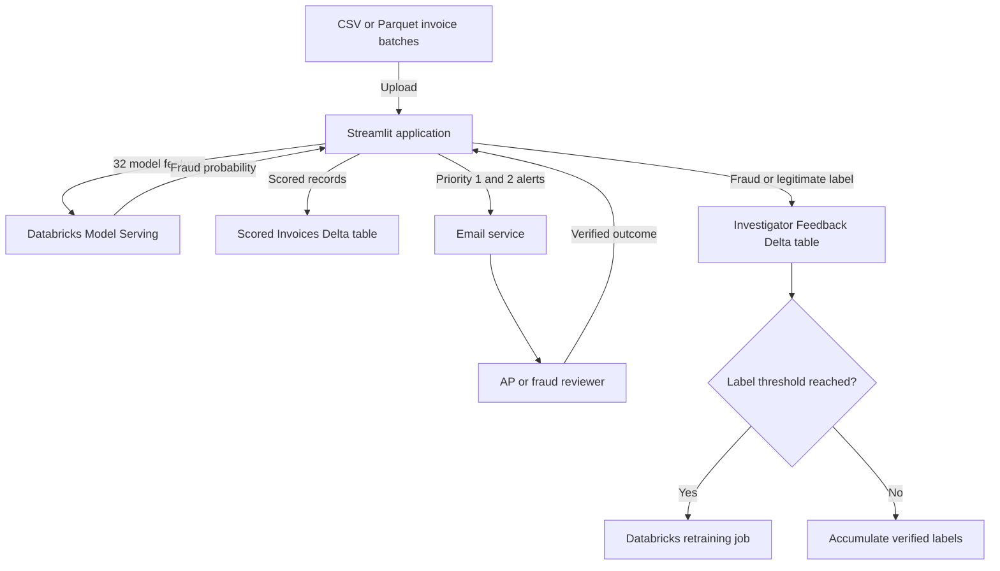

# 🛡️ RiskCheck AI

### Intelligent Invoice Fraud Detection and Investigation Prioritisation

[](https://riskcheck-ai.streamlit.app/)
[](https://www.python.org/)
[](https://streamlit.io/)
[](https://www.databricks.com/)
[](https://delta.io/)
[](LICENSE)

RiskCheck AI is an end-to-end invoice fraud detection and investigation support system. It helps accounts payable teams process invoice batches, identify suspicious transactions, prioritise reviews, notify investigators, and capture verified outcomes for future model retraining.

The solution combines a Streamlit interface with Databricks Model Serving and Delta Lake to create a practical, auditable human-in-the-loop fraud detection workflow.

> **Live application:** [riskcheck-ai.streamlit.app](https://riskcheck-ai.streamlit.app/)

## Key Features

### Batch invoice scoring

- Upload multiple CSV or Parquet files.
- Validate `invoice_id` and the 32 required model features.
- Score large batches through a Databricks Model Serving endpoint.
- Split requests into manageable chunks for reliable processing.

### Risk-based investigation queue

Fraud probabilities are converted into a 0–100 RiskCheck Score and grouped into five investigation priorities.

| Priority | Score | Risk level | Recommended action |
| --- | ---: | --- | --- |
| Priority 1 | 80–100 | Critical | Investigate immediately |
| Priority 2 | 60–79.99 | High | Perform high-priority manual review |
| Priority 3 | 40–59.99 | Elevated | Perform standard manual review |
| Priority 4 | 20–39.99 | Moderate | Monitor or conduct secondary review |
| Priority 5 | 0–19.99 | Low | Continue routine processing |

### Automated alerts

- Send formatted HTML email alerts for Priority 1 and Priority 2 invoices.
- Display individual invoice risk summaries within each alert.
- Provide deep links that take reviewers directly to the relevant batch.

### Persistent audit trail

- Store scored invoices in a Databricks Delta table.
- Preserve batch and scoring information for review and audit purposes.
- Use chunked parameter queries to remain within SQL parameter limits.

### Human-in-the-loop learning

- Allow investigators to classify reviewed invoices as **Fraud** or **Legitimate**.
- Store verified outcomes separately from model predictions.
- Track labels that have not yet been consumed by retraining.
- Trigger a Databricks retraining job after the configured label threshold is reached.

## Architecture



## Application Workflow

| Stage | Process | Output |
| ---: | --- | --- |
| 1 | An AP user uploads one or more invoice files. | CSV or Parquet batch received |
| 2 | RiskCheck AI validates the schema and prepares the model features. | Validated scoring dataset |
| 3 | Records are sent to Databricks Model Serving in manageable chunks. | Fraud probabilities |
| 4 | Each prediction is converted into a RiskCheck Score and priority level. | Ranked investigation queue |
| 5 | Results are stored in Delta Lake and high-risk alerts are sent. | Persistent audit record and reviewer notification |
| 6 | Investigators classify reviewed invoices as Fraud or Legitimate. | Verified human feedback |
| 7 | The system checks the number of unconsumed labels against the configured threshold. | Retraining job triggered or labels retained for later |

## Technology Stack

| Area | Technology |
| --- | --- |
| User interface | Streamlit |
| Application language | Python |
| Model inference | Databricks Model Serving |
| Data storage | Delta Lake through Databricks SQL |
| Notifications | SMTP email |
| Model lifecycle | Databricks Jobs and investigator feedback |
| Data formats | CSV and Parquet |

## Project Structure

```text
RiskCheck-AI/
├── README.md
├── requirements.txt
├── RiskCheck AI.ipynb
├── RiskCheck AI - Automated Retraining.ipynb
├── Demo files/
└── riskcheck_streamlit_app/
    ├── app.py
    ├── requirements.txt
    ├── retraining_notebook_template.py
    ├── .streamlit/
    │   └── secrets.toml.example
    └── riskcheck/
        ├── __init__.py
        ├── features.py
        ├── scoring.py
        ├── databricks_io.py
        └── emailer.py
```

### Component Responsibilities

| Component | Responsibility |
| --- | --- |
| `app.py` | Runs the Streamlit interface and coordinates the application workflow. |
| `riskcheck/features.py` | Defines and validates the 32 model input features. |
| `riskcheck/scoring.py` | Calls the serving endpoint and assigns scores and priority bands. |
| `riskcheck/databricks_io.py` | Handles Delta table operations and retraining-job triggers. |
| `riskcheck/emailer.py` | Builds and sends high-priority HTML email alerts. |
| `retraining_notebook_template.py` | Provides the Spark-based automated retraining workflow. |
| Model development notebook | Covers data preparation, feature engineering, training, and evaluation. |
| Automated retraining notebook | Supports model updates using newly verified investigator labels. |

## Input Data Requirements

Each uploaded file must contain `invoice_id` and the following 32 model features:

| Feature group | Required columns |
| --- | --- |
| Record identifier | `invoice_id` |
| Invoice value | `invoice_amount`, `avg_invoice_amount`, `log_invoice_amount` |
| Submission timing | `submission_hour`, `invoice_day_of_week`, `late_night_submission_flag`, `weekend_invoice_flag`, `outside_business_hours_flag` |
| Supplier activity | `supplier_invoice_count_30d`, `supplier_avg_amount_90d`, `supplier_age_days`, `supplier_age_years` |
| Supplier risk | `supplier_risk_score`, `blacklisted_flag` |
| Amount anomalies | `invoice_amount_zscore`, `amount_to_supplier_90d_avg_ratio`, `amount_to_supplier_avg_ratio`, `amount_diff_supplier_90d_avg` |
| Invoice-pattern flags | `duplicate_invoice_flag`, `split_invoice_flag` |
| Budget comparison | `annual_budget`, `invoice_to_department_budget_ratio` |
| OCR and image checks | `ocr_total_extracted`, `image_tamper_flag`, `image_metadata_available_flag`, `invoice_ocr_amount_diff`, `invoice_ocr_relative_diff` |
| Payment terms | `payment_terms_NET30`, `payment_terms_NET60`, `payment_terms_NET90` |
| Invoice type | `invoice_type_GOODS`, `invoice_type_SERVICES` |

| File requirement | Supported value |
| --- | --- |
| File format | CSV or Parquet |
| Identifier columns | 1 (`invoice_id`) |
| Model feature columns | 32 |
| Total required columns | 33 |

Demo invoice batches are available in the `Demo files/` directory.

## Data Tables

| Purpose | Default table |
| --- | --- |
| Scored invoice history | `workspace.default.riskcheck_scored_invoices` |
| Verified investigator outcomes | `workspace.default.riskcheck_investigator_feedback` |

Table names and the retraining threshold can be configured for the target Databricks environment.

## Security and Responsible Use

- Credentials and tokens are supplied through Streamlit secrets and are not committed to source control.
- Model predictions are decision-support signals, not confirmed fraud determinations.
- High-risk invoices should be reviewed by an authorised investigator before action is taken.
- Verified outcomes are kept separate from predictions to support traceability and controlled retraining.
- Production deployments should apply appropriate access controls, secret rotation, data retention policies, and monitoring.

## Internship and Capstone Project

RiskCheck AI was developed as the final project of a **Data Analytics Internship and Capstone Program with SURE ProEd (formerly SURE Trust)**.

The program focused on practical experience in data analysis, SQL, Python, data visualisation, business intelligence, machine learning, and dashboard development. RiskCheck AI brings these skills together in a complete fraud analytics workflow—from data validation and feature engineering to model inference, investigation support, audit storage, and feedback-driven retraining.

**Skills applied:** Python · SQL · Machine Learning · Data Analysis · Feature Engineering · Databricks · Delta Lake · Streamlit · Business Intelligence

## Future Improvements

- Add explainability insights for individual risk scores.
- Introduce role-based access control for AP users and investigators.
- Add model drift, data quality, and retraining performance monitoring.
- Support configurable alert routing by business unit or supplier category.
- Expand case-management features for investigation notes and evidence.

**Program:** Sure Trust Data Analytics Internship & Capstone Program

- [Sure Trust Data Analytics Repository](https://github.com/sure-trust/MATHEW-GEORGE-g1-data-analytics)
- [Sure Trust Wesite](https://www.suretrustforruralyouth.com/)
---

Built as a practical demonstration of fraud analytics, human review, and responsible machine learning operations.
