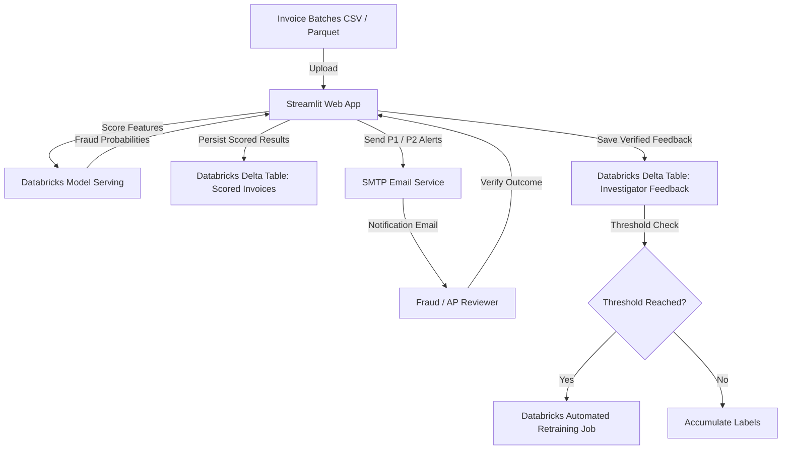

# 🛡️ RiskCheck AI: Invoice Fraud Detection & Retraining Pipeline

[](https://share.streamlit.io/)
[](https://www.python.org/)
[](https://www.databricks.com/)
[](https://delta.io/)

RiskCheck AI is an end-to-end invoice fraud risk scoring and investigation prioritisation system built with **Streamlit**, **Databricks Model Serving**, and **Delta Lake**.

It enables accounts payable (AP) teams and fraud investigators to triage high-volume invoice batches, prioritize suspicious activity, alert relevant teams automatically, and capture verified human outcomes to safely retrain machine learning models.

---

## 🌟 Key Capabilities

1. **Multi-File Batch Scoring**:
   - Supports CSV and Parquet invoice batches.
   - Validates the required 32 behavioral, supplier, and transactional model features.
   - Scores batches against a Databricks Model Serving endpoint with chunked payload management.
2. **5-Tier Investigation Priority Ranking**:
   - Converts fraud probability (0–1) into a calibrated 0–100 RiskCheck Score:
     - **Priority 1 (Critical Risk, $\ge$ 80)**: Immediate fraud investigation
     - **Priority 2 (High Risk, 60–80)**: High-priority manual review
     - **Priority 3 (Elevated Risk, 40–60)**: Standard manual review
     - **Priority 4 (Moderate Risk, 20–40)**: Monitoring and secondary review
     - **Priority 5 (Low Risk, < 20)**: Routine automated processing
3. **Automated Priority Alerts (Email)**:
   - Dispatches formatted HTML email notifications with individual invoice risk cards for Priority 1 and Priority 2 flags.
   - Includes direct deep-links (`?review_batch=<batch_id>`) for reviewers to open the batch directly.
4. **Persistent Audit & Delta Lake Integration**:
   - All scored batches are automatically persisted to Databricks SQL Delta tables (`workspace.default.riskcheck_scored_invoices`).
   - Supports batch-chunked parameter queries to adhere to SQL parameter boundaries.
5. **Human-in-the-Loop Feedback & Automated Retraining**:
   - Investigators record verified outcomes (*Fraud* or *Legitimate*) in `workspace.default.riskcheck_investigator_feedback`.
   - Once the threshold of unconsumed verified labels is reached (e.g., 200 labels), the app triggers an automated Databricks Retraining Job via REST API.

---

## 📐 Architecture



---

## 📂 Project Structure

```text
RiskCheck-AI/
├── .gitignore                                 # Protects secrets and virtual environments
├── README.md                                  # Project overview and deployment guide
├── requirements.txt                           # Global dependencies for Streamlit Cloud
├── RiskCheck AI.ipynb                         # Model development & training notebook
├── RiskCheck AI - Automated Retraining.ipynb  # Databricks retraining pipeline notebook
├── Demo files/                                # Sample invoice batches for testing
│   ├── Crescent_Retail_Group_September_2026.csv
│   ├── Harborview_Logistics_September_2026.csv
│   ├── Northbridge_Manufacturing_September_2026.csv
│   └── New folder/                            # Small sample batches (10-50 rows)
└── riskcheck_streamlit_app/                   # Streamlit Application
    ├── app.py                                 # Main Streamlit dashboard
    ├── requirements.txt                       # App-specific dependencies
    ├── retraining_notebook_template.py        # Spark retraining job template
    ├── .streamlit/
    │   └── secrets.toml.example               # Secrets configuration template
    └── riskcheck/                             # Core Python package
        ├── __init__.py
        ├── features.py                        # 32 model feature definitions
        ├── scoring.py                         # Model serving invocations & bands
        ├── databricks_io.py                   # Delta Lake I/O & Retraining triggers
        └── emailer.py                         # HTML alert notifications
```

---

## 🚀 Running Locally

### 1. Clone the repository
```bash
git clone https://github.com/mathewgeorge24/RiskCheck-AI.git
cd RiskCheck-AI/riskcheck_streamlit_app
```

### 2. Set up Python environment
```bash
python -m venv .venv
# Windows:
.venv\Scripts\activate
# macOS/Linux:
source .venv/bin/activate

pip install -r requirements.txt
```

### 3. Configure secrets
Copy `.streamlit/secrets.toml.example` to `.streamlit/secrets.toml`:
```bash
cp .streamlit/secrets.toml.example .streamlit/secrets.toml
```
Fill in your credentials:
```toml
[databricks]
host = "https://<your-workspace>.cloud.databricks.com"
token = "dapi..."
serving_endpoint = "riskcheck-ai-endpoint"

[databricks_sql]
server_hostname = "<your-workspace>.cloud.databricks.com"
http_path = "/sql/1.0/warehouses/<your-warehouse-id>"
access_token = "dapi..."
upload_table = "workspace.default.riskcheck_scored_invoices"
feedback_table = "workspace.default.riskcheck_investigator_feedback"

[retraining]
min_new_verified_labels = 200
retraining_job_id = "<your-job-id>"

[email]
enabled = true
smtp_host = "smtp.gmail.com"
smtp_port = 587
smtp_username = "your-email@gmail.com"
smtp_password = "your-app-password"
from_address = "your-email@gmail.com"
app_url = "http://localhost:8501"
priority_1_recipients = ["your-email@gmail.com"]
priority_2_recipients = ["your-email@gmail.com"]
```

### 4. Launch the application
```bash
streamlit run app.py
```
Open `http://localhost:8501` in your browser.

---

## ☁️ Deploying to Streamlit Community Cloud

1. Push this repository to your GitHub account: `https://github.com/mathewgeorge24/RiskCheck-AI`
2. Go to [Streamlit Community Cloud](https://share.streamlit.io/) and log in with GitHub.
3. Click **"New app"** (or **"Create app"**).
4. Select your repository:
   - **Repository**: `mathewgeorge24/RiskCheck-AI`
   - **Branch**: `main`
   - **Main file path**: `riskcheck_streamlit_app/app.py`
5. In **Advanced settings** (or under App Settings $\rightarrow$ Secrets):
   - Paste the contents of your `secrets.toml` into the **Secrets** text box.
   - Update `app_url` in `[email]` to match your Streamlit Cloud URL (e.g. `https://riskcheck-ai.streamlit.app`).
6. Click **Deploy!**

---

## 📋 Upload Schema (33 Columns)

Each uploaded CSV or Parquet file must contain `invoice_id` plus the 32 model features:

```text
invoice_id, invoice_amount, submission_hour, supplier_invoice_count_30d,
supplier_avg_amount_90d, invoice_amount_zscore, duplicate_invoice_flag,
split_invoice_flag, late_night_submission_flag, supplier_age_days,
supplier_risk_score, blacklisted_flag, avg_invoice_amount, annual_budget,
ocr_total_extracted, image_tamper_flag, amount_to_supplier_90d_avg_ratio,
amount_to_supplier_avg_ratio, amount_diff_supplier_90d_avg, supplier_age_years,
invoice_day_of_week, weekend_invoice_flag, outside_business_hours_flag,
invoice_to_department_budget_ratio, log_invoice_amount,
image_metadata_available_flag, invoice_ocr_amount_diff,
invoice_ocr_relative_diff, payment_terms_NET30, payment_terms_NET60,
payment_terms_NET90, invoice_type_GOODS, invoice_type_SERVICES
```

---

## 📄 License

This project is licensed under the MIT License.
